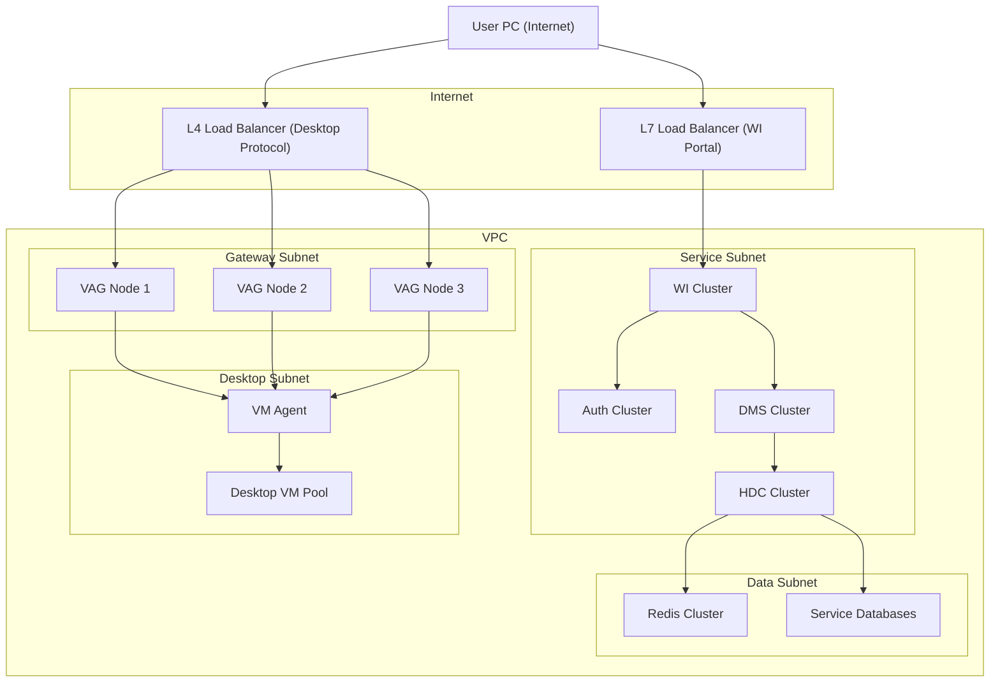

# Cloud Desktop Architecture (500–2000 Users)

This document describes a cloud desktop deployment architecture designed for 500–2000 desktop users.

Key design decisions:

- No NAT Gateway
- WI exposed through **L7 Load Balancer**
- VAG exposed through **L4 Load Balancer**
- VAG connects directly to **VM Agent** for graphical transmission
- Control services isolated in private subnets

---

## 1. Scale Assumptions

| Metric | Value |
|---|---|
| Desktop Users | 500–2000 |
| Concurrent Sessions | 300–1500 |
| Desktop VMs | 500–2000 |
| Deployment | Single region |
| Availability | High availability |

---

## 2. Network Resources

| Resource        | Quantity | Purpose                                   | Monthly Price | Yearly Price |
|-----------------|----------|-------------------------------------------|--------------|-------------|
| VPC             | 1        | Main private network                      | Free         | Free        |
| Subnets         | 4        | Public, Service, Data, Desktop            | Free         | Free        |
| Route Tables    | 2        | Internal routing                          | Free         | Free        |
| Security Groups | 5        | Access control (virtual firewall rules)   | Free         | Free        |
| Elastic IP      | 2        | Public entry (Load Balancer / Bastion)    | ~$5–10 each  | ~$120–240   |

---

## 3. Load Balancers

| Component | Quantity | Purpose | Monthly Cost | Yearly Cost |
|---|---|---|---|---|
| L7 Load Balancer | 1 | WI web portal | $120 | $1,440 |
| L4 Load Balancer | 1 | Desktop protocol (VAG) | $100 | $1,200 |

---

## 4. VAG Gateway Cluster

| Resource | Quantity | Specification | Monthly Cost (Each) | Yearly Cost (Total) |
|---|---|---|---|---|
| VAG Node | 3 | 8 vCPU / 16 GB RAM | $150 | $5,400 |

Capacity estimate:

- 200–400 concurrent sessions per node
- 600–1200 concurrent sessions for the cluster

---

## 5. WI Service Cluster

| Resource | Quantity | Specification | Monthly Cost (Each) | Yearly Cost (Total) |
|---|---|---|---|---|
| WI Server | 3 | 4 vCPU / 8 GB RAM | $80 | $2,880 |

---

## 6. Authentication Service

| Resource | Quantity | Specification | Monthly Cost (Each) | Yearly Cost (Total) |
|---|---|---|---|---|
| Auth Server | 3 | 2 vCPU / 4 GB RAM | $50 | $1,800 |

---

## 7. Desktop Management Service (DMS)

| Resource | Quantity | Specification | Monthly Cost (Each) | Yearly Cost (Total) |
|---|---|---|---|---|
| DMS Node | 3 | 4 vCPU / 8 GB RAM | $80 | $2,880 |

---

## 8. HDC Service

| Resource | Quantity | Specification | Monthly Cost (Each) | Yearly Cost (Total) |
|---|---|---|---|---|
| HDC Node | 3 | 4 vCPU / 8 GB RAM | $80 | $2,880 |

---

## 9. Redis Cluster

| Resource | Quantity | Specification | Monthly Cost (Each) | Yearly Cost (Total) |
|---|---|---|---|---|
| Redis Node | 3 | 4 vCPU / 16 GB RAM | $120 | $4,320 |

Purpose:

- Session state
- Connection state
- VM status cache

---

## 10. Databases

| Database | Specification | Monthly Cost | Yearly Cost |
|---|---|---|---|
| WI Database | 8 vCPU / 32 GB | $250 | $3,000 |
| Auth Database | 8 vCPU / 32 GB | $250 | $3,000 |
| DMS Database | 8 vCPU / 32 GB | $250 | $3,000 |
| HDC Database | 8 vCPU / 32 GB | $250 | $3,000 |

Total yearly database cost: **$12,000**

---

## 11. Bastion Host

| Resource | Specification | Monthly Cost | Yearly Cost |
|---|---|---|---|
| Bastion VM | 2 vCPU / 4 GB RAM | $40 | $480 |

---

## 12. Monitoring and Logging

| Resource | Specification | Monthly Cost | Yearly Cost |
|---|---|---|---|
| Monitoring Node | 2 vCPU / 4 GB RAM | $40 | $480 |
| Logging Node | 4 vCPU / 8 GB RAM | $80 | $960 |

---

## 13. Desktop VM Pool

| VM Specification | Monthly Cost |
|---|---|
| 4 vCPU / 8 GB | $45 |

Estimated yearly cost:

| Desktop Users | Yearly Cost |
|---|---|
| 500 | $270,000 |
| 1000 | $540,000 |
| 2000 | $1,080,000 |

---

## 14. Estimated Infrastructure Cost (Without Desktop VMs)

| Component | Yearly Cost |
|---|---|
| Load Balancers | $2,640 |
| VAG Cluster | $5,400 |
| WI Cluster | $2,880 |
| Auth Cluster | $1,800 |
| DMS Cluster | $2,880 |
| HDC Cluster | $2,880 |
| Redis Cluster | $4,320 |
| Databases | $12,000 |
| Bastion Host | $480 |
| Monitoring and Logging | $1,440 |

Total: **≈ $36,720 per year**

---

## 15. Architecture Diagram

