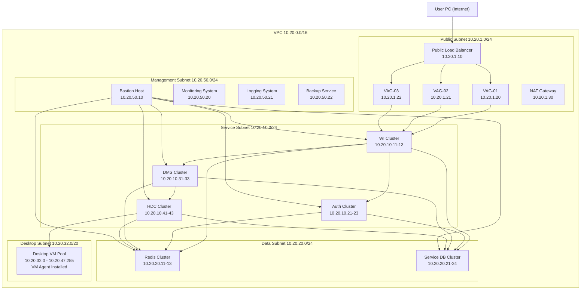

# Cloud Desktop Network Architecture Design (Public Cloud)

This document describes a **public cloud network architecture design** for a cloud desktop system.

Focus of this document:

- What cloud resources need to be purchased / prepared
- How to split the network
- VPC / subnet / IP planning
- A detailed network architecture graph with IP ranges

This document does **not** explain the business responsibility of each service.

---

## 1. Design Goal

Build a cloud desktop system in **public cloud** with these characteristics:

- Users access from the Internet
- Backend control services are deployed inside a private VPC
- Desktop VMs are isolated in a dedicated subnet
- Databases and Redis are isolated in a dedicated data subnet
- Public exposure is minimized to only edge access components
- Architecture supports high availability and future horizontal scaling

---

## 2. Public Cloud Resources to Buy / Prepare

A typical public-cloud deployment usually needs the following resources.

### 2.1 Core Network Resources

| Resource | Quantity Suggestion | Example Purpose |
|---|---:|---|
| VPC | 1 | Main private network for the whole system |
| Subnets | 4-5 | Public / Service / Data / Desktop / Optional management |
| Route Tables | 1-3 | Internal routing and subnet control |
| Security Groups | 5+ | Fine-grained access control by role |
| Elastic IP (EIP) | 2-4 | Public entry points such as LB / gateway |
| NAT Gateway | 1-2 | Outbound Internet access for private resources if needed |

### 2.2 Edge Access Resources

| Resource | Quantity Suggestion | Example Purpose |
|---|---:|---|
| Public Load Balancer | 1 | Internet entry for web/API traffic |
| Optional Desktop Access Gateway / VAG | 2-3 nodes | Remote desktop access entry / traffic relay |
| Optional WAF | 1 | Protect public web/API entry |
| Optional Anti-DDoS | 1 | Public attack protection |

### 2.3 Compute Resources

| Resource | Quantity Suggestion | Example Purpose |
|---|---:|---|
| WI Service ECS / VM | 3 | Web interface backend |
| Authentication Service ECS / VM | 3 | Authentication backend |
| DMS ECS / VM | 3 | Desktop management backend |
| HDC ECS / VM | 3 | Desktop communication backend |
| VAG ECS / VM | 2-3 | Desktop protocol access gateway |
| Bastion Host | 1 | Secure O&M access |
| Desktop VMs | N | User cloud desktops |

### 2.4 Data Resources

| Resource | Quantity Suggestion | Example Purpose |
|---|---:|---|
| Redis Cluster | 3 nodes | Session / connection / VM state cache |
| WI Database | 1 primary + replicas optional | WI service persistence |
| Auth Database | 1 primary + replicas optional | Auth persistence |
| DMS Database | 1 primary + replicas optional | DMS persistence |
| HDC Database | 1 primary + replicas optional | HDC persistence |
| Optional MQ | 3 nodes | Event-driven communication |
| Object Storage | 1 | Logs / installers / exported files / snapshots metadata |

### 2.5 Ops / Security Resources

| Resource | Quantity Suggestion | Example Purpose |
|---|---:|---|
| Monitoring Service | 1 | Metrics / alarms |
| Log Service | 1 | Centralized logging |
| KMS / Secrets Manager | 1 | Key / password management |
| Backup Service | 1 | DB backup / snapshot policy |
| Image Repository | 1 | VM image / container image storage |

---

## 3. High-Level Network Design Principle

Use **one VPC** for one production system, then split by subnet.

### Recommended production layout

- **1 VPC**
- **1 public subnet**
- **1 service subnet**
- **1 data subnet**
- **1 desktop subnet**
- **optional 1 management subnet**

Why:

- easier routing
- simpler security boundary
- internal private communication
- better organization by resource type
- easy expansion later

---

## 4. IP Plan

### 4.1 VPC CIDR

Use one large private network:

```text
VPC CIDR: 10.20.0.0/16
Subnet Mask: 255.255.0.0
Available IP range: 10.20.0.1 - 10.20.255.254
```

This gives enough room for future scale.

---

## 5. Subnet Split

## 5.1 Public Subnet

```text
Subnet Name: public-subnet
CIDR: 10.20.1.0/24
Mask: 255.255.255.0
Available IPs: about 251
Purpose: Internet-facing components
```

Typical resources:

- Public Load Balancer
- VAG nodes with EIP or fronted by LB
- Optional NAT Gateway
- Optional WAF integration point

Suggested IP allocation example:

```text
10.20.1.10  Public Load Balancer
10.20.1.20  VAG-01
10.20.1.21  VAG-02
10.20.1.22  VAG-03
10.20.1.30  NAT Gateway
10.20.1.40  Bastion Public NIC (optional)
```

---

## 5.2 Service Subnet

```text
Subnet Name: service-subnet
CIDR: 10.20.10.0/24
Mask: 255.255.255.0
Available IPs: about 251
Purpose: internal control-plane microservices
```

Typical resources:

- WI Service nodes
- Authentication Service nodes
- DMS nodes
- HDC nodes
- Optional internal service LB / service discovery endpoints

Suggested IP allocation example:

```text
10.20.10.11  WI-01
10.20.10.12  WI-02
10.20.10.13  WI-03

10.20.10.21  AUTH-01
10.20.10.22  AUTH-02
10.20.10.23  AUTH-03

10.20.10.31  DMS-01
10.20.10.32  DMS-02
10.20.10.33  DMS-03

10.20.10.41  HDC-01
10.20.10.42  HDC-02
10.20.10.43  HDC-03
```

---

## 5.3 Data Subnet

```text
Subnet Name: data-subnet
CIDR: 10.20.20.0/24
Mask: 255.255.255.0
Available IPs: about 251
Purpose: stateful infrastructure
```

Typical resources:

- Redis cluster
- Databases
- Optional MQ cluster
- Optional internal storage gateway

Suggested IP allocation example:

```text
10.20.20.11  Redis-01
10.20.20.12  Redis-02
10.20.20.13  Redis-03

10.20.20.21  WI-DB
10.20.20.22  AUTH-DB
10.20.20.23  DMS-DB
10.20.20.24  HDC-DB

10.20.20.31  MQ-01 (optional)
10.20.20.32  MQ-02 (optional)
10.20.20.33  MQ-03 (optional)
```

---

## 5.4 Desktop Subnet

```text
Subnet Name: desktop-subnet
CIDR: 10.20.32.0/20
Mask: 255.255.240.0
Available IPs: about 4091
Purpose: cloud desktop VM pool
```

Why larger:

- desktop count is usually much higher than control-plane nodes
- easy to scale to hundreds or thousands of desktops

Range:

```text
10.20.32.0 - 10.20.47.255
```

Suggested allocation example:

```text
10.20.32.10   Desktop-VM-0001
10.20.32.11   Desktop-VM-0002
10.20.32.12   Desktop-VM-0003
...
10.20.35.10   Desktop-VM-0300
...
10.20.40.10   Desktop-VM-1000
```

Each desktop VM contains its own **VM Agent**.

---

## 5.5 Optional Management Subnet

```text
Subnet Name: mgmt-subnet
CIDR: 10.20.50.0/24
Mask: 255.255.255.0
Purpose: bastion / monitoring / admin-only tools
```

Suggested example:

```text
10.20.50.10  Bastion Host
10.20.50.20  Monitoring Node
10.20.50.21  Logging Node
10.20.50.22  Backup Controller
```

---

## 6. Mermaid Network Graph

---

## 7. Routing and Communication Design

### 7.1 Internet Exposure

Only these components should be Internet-facing:

- Public Load Balancer
- VAG nodes or their front LB
- Optional WAF endpoint
- Optional Bastion public entry

Everything else should use **private IP only**.

---

### 7.2 Internal Communication

Subnets inside the same VPC can communicate through private routing, but security groups should control access.

Recommended communication directions:

| Source | Destination | Purpose |
|---|---|---|
| Public subnet | Service subnet | user entry traffic |
| Service subnet | Data subnet | service reads/writes |
| Service subnet | Desktop subnet | HDC control-plane traffic |
| Mgmt subnet | All private subnets | admin / monitoring |
| Desktop subnet | Service subnet | VM agent reports / callbacks if needed |

---

## 8. Recommended Security Group Model

### 8.1 sg-public-edge

Allow:

- 80 / 443 from Internet to LB
- desktop protocol ports from Internet to VAG if required
- admin access only from whitelisted office IPs

### 8.2 sg-service

Allow from:

- LB to WI
- WI to AUTH / DMS
- DMS to HDC
- mgmt subnet to service nodes
- deny direct Internet inbound

### 8.3 sg-data

Allow from:

- service subnet to Redis / DB / MQ
- mgmt subnet to DB for admin-only maintenance if needed
- deny Internet inbound
- deny public subnet direct access unless explicitly required

### 8.4 sg-desktop

Allow from:

- HDC / VAG to desktop VMs
- desktop VMs outbound to update servers via NAT if required
- deny direct Internet inbound to desktop VMs by default

### 8.5 sg-mgmt

Allow only:

- corporate VPN / office IP / admin jump source

---

## 9. Suggested Traffic Model

### Web/API traffic

```text
User PC
→ Internet
→ Public LB
→ WI Service
→ Auth / DMS
→ Redis / DB
```

### Desktop connection traffic

```text
User PC
→ Internet
→ VAG
→ Desktop VM
```

or, depending on product design:

```text
User PC
→ Internet
→ VAG
→ HDC coordination
→ Desktop VM
```

### Control-plane traffic

```text
WI / DMS
→ HDC
→ Desktop VM Agent
→ Desktop VM
```

### State storage traffic

```text
WI / Auth / DMS / HDC
→ Redis cluster
→ per-service database
```

---

## 10. Why This Network Split Is Suitable

### Public subnet

Keeps only public-entry components exposed.

### Service subnet

Keeps control-plane services together for low-latency internal calls.

### Data subnet

Separates stateful services for stronger protection.

### Desktop subnet

Allows large IP capacity for scaling many desktop VMs.

### Management subnet

Separates admin tools from business traffic.

---

## 11. Capacity Planning Suggestion

### Small deployment

- Desktop users: 100-300
- Desktop subnet: `/22` is still enough, but `/20` gives future room
- 2 VAG nodes may be enough
- 3-node service cluster still recommended for HA

### Medium deployment

- Desktop users: 500-2000
- Keep desktop subnet at least `/20`
- Consider splitting desktop subnet further by pool / tenant / zone

### Large deployment

- Desktop users: 5000+
- Consider:
    - multi-AZ deployment
    - multiple desktop subnets
    - dedicated VPC per region or per environment
    - multi-cluster HDC / VAG deployment

---

## 12. Recommended Final Production Layout

```text
VPC: 10.20.0.0/16

Public Subnet:      10.20.1.0/24
Service Subnet:     10.20.10.0/24
Data Subnet:        10.20.20.0/24
Desktop Subnet:     10.20.32.0/20
Mgmt Subnet:        10.20.50.0/24
```

This layout is a practical starting point for a public-cloud cloud desktop system.

---

## 13. Final Notes

- One system usually starts with **one VPC**
- Different resource types are separated by **subnets**
- Subnets can communicate internally, but must be controlled by **security groups**
- Redis and databases should stay in **private data subnet**
- Desktop VMs should stay in a **large dedicated subnet**
- Only LB / VAG / approved admin entry should be public

This design is suitable as a **baseline network architecture** for a cloud desktop deployment on public cloud.