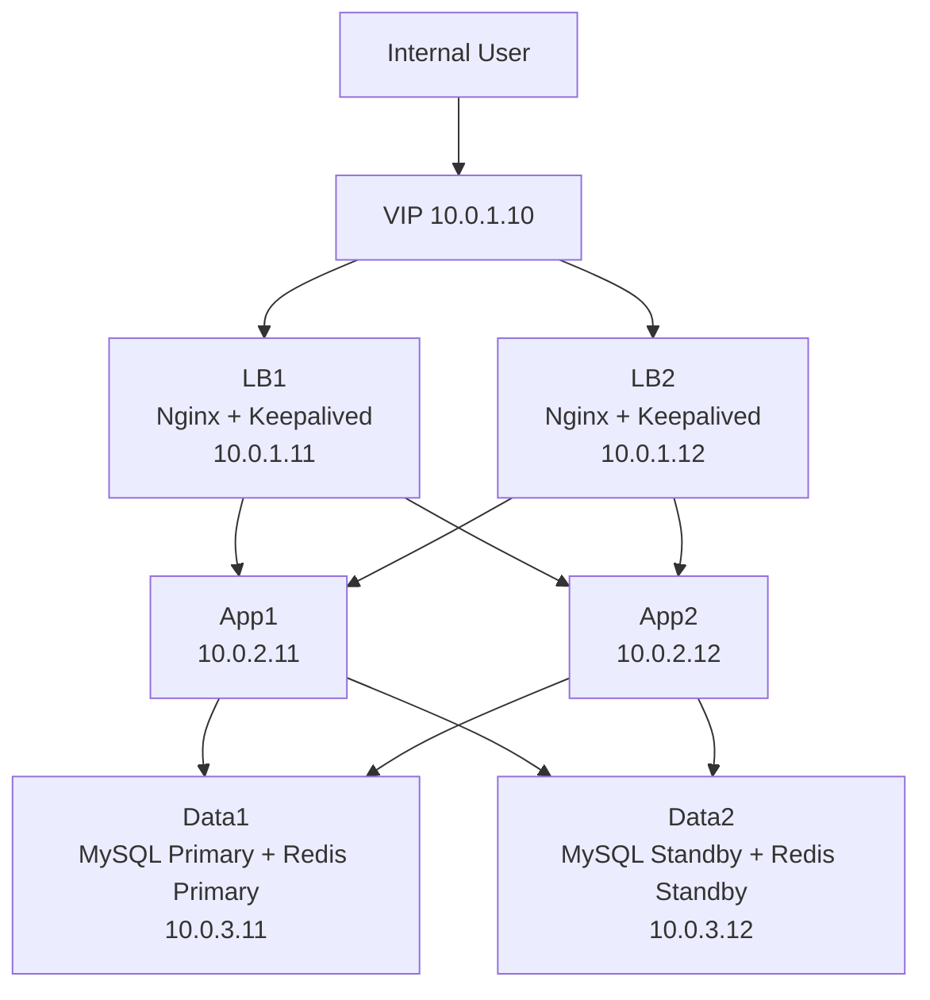

# PAS On-Premise Deployment Plan (Subnet-Segmented, 6-Node Version)

---

## 1. Overview

This document describes a more complete on-premise deployment plan for a PAS system with basic high availability and subnet isolation.

### Target Architecture

- On-Premise
- Internal network only
- Monolith application
- 2 Load Balancer nodes
- 2 Application nodes
- 2 Data nodes
- Redis and MySQL deployed on the 2 data nodes
- Subnet segmentation enabled
- Nginx used as internal load balancer
- Suitable for small to medium enterprise internal deployment

---

## 2. What to Buy

### 2.1 Network Devices

#### 1. Router / Gateway
- Quantity: **1**
- Purpose:
  - acts as default gateway for different subnets
  - routes traffic between subnets
- Note:
  - does not need Internet access
  - still required for inter-subnet communication

#### 2. Managed Switch
- Quantity: **1**
- Requirement:
  - supports VLAN

#### 3. Ethernet Cables
- Quantity: **8 to 10**
- Typical usage:
  - Router → Switch: 1
  - Switch → LB1: 1
  - Switch → LB2: 1
  - Switch → App1: 1
  - Switch → App2: 1
  - Switch → Data1: 1
  - Switch → Data2: 1
  - spare cables: 1 to 3

---

### 2.2 Server Nodes

#### 1. Load Balancer Nodes
- Quantity: **2**
- Role:
  - LB1: Nginx + Keepalived
  - LB2: Nginx + Keepalived

#### 2. Application Nodes
- Quantity: **2**
- Role:
  - App1: PAS monolith application
  - App2: PAS monolith application

#### 3. Data Nodes
- Quantity: **2**
- Role:
  - Data1: MySQL Primary + Redis Primary
  - Data2: MySQL Standby + Redis Standby

---

## 3. Recommended Subnet Design

### 3.1 Network Range

Example private network:

```text
10.0.0.0/16
```

---

### 3.2 Subnet Planning

| Subnet | CIDR | VLAN | Purpose |
|--------|------|------|---------|
| Access Subnet | 10.0.1.0/24 | VLAN 10 | Load balancers / VIP |
| App Subnet | 10.0.2.0/24 | VLAN 20 | Application servers |
| Data Subnet | 10.0.3.0/24 | VLAN 30 | MySQL + Redis |
| Mgmt Subnet | 10.0.4.0/24 | VLAN 40 | Optional management access |

---

### 3.3 Gateway Planning

| Subnet | Gateway |
|--------|---------|
| Access Subnet | 10.0.1.1 |
| App Subnet | 10.0.2.1 |
| Data Subnet | 10.0.3.1 |
| Mgmt Subnet | 10.0.4.1 |

---

## 4. IP Assignment Example

| Node / Service | IP |
|----------------|----|
| Router Gateway (Access) | 10.0.1.1 |
| Router Gateway (App) | 10.0.2.1 |
| Router Gateway (Data) | 10.0.3.1 |
| LB1 | 10.0.1.11 |
| LB2 | 10.0.1.12 |
| VIP | 10.0.1.10 |
| App1 | 10.0.2.11 |
| App2 | 10.0.2.12 |
| Data1 | 10.0.3.11 |
| Data2 | 10.0.3.12 |

---

## 5. Final Topology

### Node Roles

| Node | Components |
|------|------------|
| LB1 | Nginx + Keepalived |
| LB2 | Nginx + Keepalived |
| App1 | PAS Application |
| App2 | PAS Application |
| Data1 | MySQL Primary + Redis Primary |
| Data2 | MySQL Standby + Redis Standby |

---

## 6. Network Communication Rules

### Allowed

- User → VIP (80 / 443)
- LB subnet → App subnet (8080 or app port)
- App subnet → Data subnet
  - MySQL: 3306
  - Redis: 6379
- Data1 → Data2
  - MySQL replication
  - Redis replication
- Management subnet → all nodes (SSH / monitoring)

---

### Denied

- User subnet → Data subnet directly
- LB subnet → Data subnet directly
- External network → App / Data directly

---

## 7. Manual Setup Steps

### Step 1 — Prepare Hardware

Buy and prepare:

- 1 router / gateway
- 1 managed switch with VLAN support
- 6 servers or VMs
- 8 to 10 Ethernet cables

---

### Step 2 — Connect Physical Devices

Connect:

- Router → Switch
- Switch → LB1
- Switch → LB2
- Switch → App1
- Switch → App2
- Switch → Data1
- Switch → Data2

---

### Step 3 — Configure VLAN on Switch

Example:

- VLAN 10 → Access subnet
- VLAN 20 → App subnet
- VLAN 30 → Data subnet
- VLAN 40 → Management subnet

Assign ports based on node role.

---

### Step 4 — Configure Router / Gateway

Create one gateway IP per subnet:

- 10.0.1.1
- 10.0.2.1
- 10.0.3.1
- 10.0.4.1

Enable routing between subnets.

---

### Step 5 — Assign Static IPs

Set static IP on each server according to the plan.

Also configure:

- subnet mask
- default gateway
- internal DNS if available

---

### Step 6 — Install Load Balancers

On LB1 and LB2:

- install Nginx
- install Keepalived
- configure VIP: 10.0.1.10

Nginx upstream example:

```nginx
upstream backend {
    server 10.0.2.11:8080 max_fails=2 fail_timeout=5s;
    server 10.0.2.12:8080 max_fails=2 fail_timeout=5s;
}
```

Keepalived provides VIP failover between LB1 and LB2.

---

### Step 7 — Install Application

On App1 and App2:

- install JDK
- deploy PAS Spring Boot application
- configure database connection to MySQL Primary
- configure Redis connection to Redis Primary

Recommended:
- app nodes remain stateless as much as possible

---

### Step 8 — Install MySQL

On Data1:
- install MySQL Primary

On Data2:
- install MySQL Standby

Configure:
- binary log
- replication user
- standby replication
- failover procedure

---

### Step 9 — Install Redis

On Data1:
- install Redis Primary

On Data2:
- install Redis Standby

Configure:
- replicaof
- AOF persistence
- optional Sentinel later if needed

---

### Step 10 — Configure Firewall / ACL

Allow only required traffic:

- LB → App
- App → Data
- Mgmt → all

Block unnecessary direct access.

---

### Step 11 — Testing

Test the following:

- VIP access
- LB1 down → VIP moves to LB2
- App1 down → Nginx routes to App2
- Redis Primary down → standby promotion procedure
- MySQL Primary down → standby failover procedure

---

## 8. Traffic Flow

### User Request Flow

```text
User → VIP → LB1/LB2 → App1/App2 → MySQL Primary / Redis Primary
```

### Replication Flow

```text
MySQL Primary → MySQL Standby
Redis Primary → Redis Standby
```

---

## 9. Mermaid Diagram



---

## 10. What This Plan Solves

This plan improves over the previous cheap version by adding:

- separate load balancer layer
- separate application layer
- separate data layer
- subnet isolation
- VIP failover
- better security and architecture clarity

---

## 11. Limitations

- still only 1 router
- still only 1 switch
- MySQL and Redis are colocated on same data nodes
- failover for DB and Redis may still require manual or semi-automatic handling

---

## 12. Summary

### Total Items to Buy

#### Network Devices
- 1 router / gateway
- 1 managed switch with VLAN support
- 8 to 10 Ethernet cables

#### Server Nodes
- 2 load balancer nodes
- 2 application nodes
- 2 data nodes

### Total Node Count
- **6 nodes**

This is a balanced small-enterprise on-premise PAS deployment plan with:

- subnet segmentation
- active-active application layer
- dual load balancers with VIP
- primary-standby data layer
- reasonable cost and clear upgrade path
