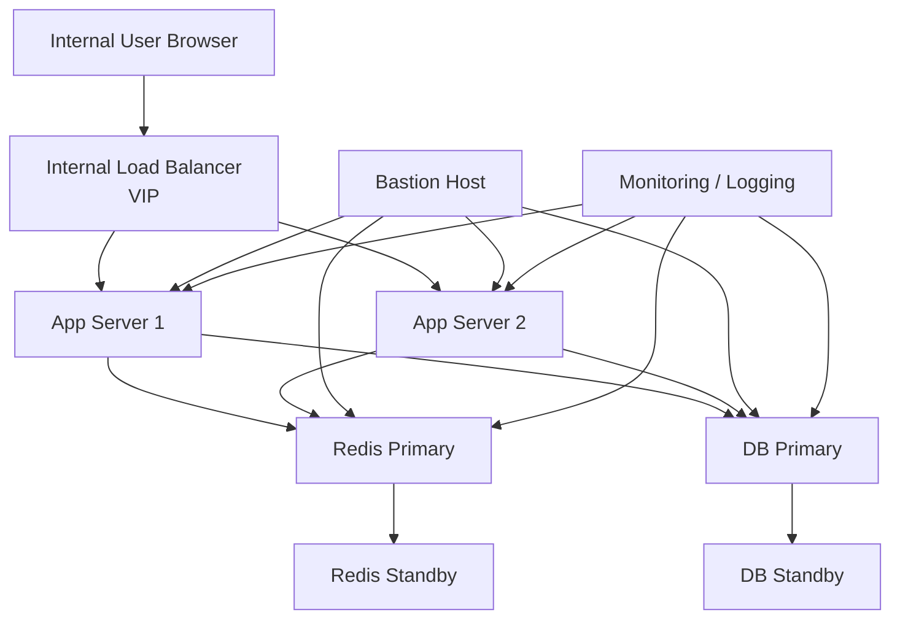

# PAS System Infrastructure Architecture (On-Premise, Internal Network)

## 1. Overview

This document describes the infrastructure architecture for a PAS (Policy Administration System) deployed in an **On-Premise environment** within a **customer's internal network**.

### Key Characteristics

- **Deployment Model:** On-Premises
- **Network:** Fully internal, no Internet exposure
- **Application Architecture:** Monolith
- **High Availability Strategy:**
  - Web/Application Layer → Active-Active
  - Redis → Active-Standby
  - Database → Active-Standby
- **Container Platform:** Not using Kubernetes

---

## 2. Architecture Design Principles

### 2.1 Security First
- No public Internet access
- All services are deployed inside the internal network
- Access is controlled through internal firewall and security policies

### 2.2 High Availability
- Web layer supports horizontal scaling with Active-Active deployment
- Stateful components use Active-Standby failover

### 2.3 Simplicity
- Monolith architecture reduces complexity
- No Kubernetes, easier operations and maintenance

### 2.4 Stability over Elasticity
- Fixed resource allocation
- No dynamic scaling

---

## 3. Infrastructure Components

### 3.1 Client Layer
- Internal users such as underwriting staff, operations staff, and customer service staff
- Access through browser in LAN or enterprise VPN

### 3.2 Access Layer
#### Internal Load Balancer
- Distributes traffic across application nodes
- Performs health checks
- Uses internal VIP only, no public IP

### 3.3 Application Layer
#### PAS Application Servers (Active-Active)
- Multiple monolith application instances
- Recommended to keep application nodes stateless as much as possible
- Main responsibilities:
  - product management
  - quotation
  - underwriting
  - policy issuance
  - endorsement
  - renewal
  - user operations

### 3.4 Cache Layer
#### Redis (Primary-Standby)
- Used for:
  - session cache
  - distributed lock
  - temporary data
- Topology:
  - 1 Primary
  - 1 Standby
- Failover can be handled by Sentinel or manual switch

### 3.5 Data Layer
#### Database (Primary-Standby)
- Relational database such as Oracle, PostgreSQL, or MySQL
- Topology:
  - Primary for read/write
  - Standby for replication and failover
- Responsibilities:
  - policy data persistence
  - transaction support
  - backup and recovery
  - high consistency

### 3.6 Management Layer (Optional but Recommended)
- Bastion Host
- Monitoring System
- Logging System
- Backup System

---

## 4. Recommended Network Segmentation

| Subnet | Purpose |
|--------|---------|
| Access Subnet | Internal load balancer |
| Application Subnet | PAS application servers |
| Cache Subnet | Redis nodes |
| Data Subnet | Database nodes |
| Management Subnet | Bastion, monitoring, logging, backup |

---

## 5. Network Architecture Diagram

---

## 6. Data Flow

1. User sends request through browser
2. Request reaches the internal load balancer VIP
3. Load balancer routes traffic to one application server
4. Application server accesses:
   - Redis Primary for cache
   - Database Primary for persistent business data
5. Redis Primary replicates to Redis Standby
6. Database Primary replicates to Database Standby

---

## 7. Advantages

- High security because the system is not exposed to the Internet
- Simple architecture, suitable for enterprise internal systems
- High availability at application and data layers
- Easy for enterprise IT teams to manage in controlled environments

---

## 8. Limitations

- Scalability is mostly manual
- No auto-healing capability like Kubernetes
- Resource usage may be less flexible
- Disaster recovery across sites is not included unless extra DR design is added

---

## 9. Suitable Scenarios

- Insurance PAS systems
- Banking internal systems
- Government internal systems
- Enterprise internal management platforms

---

## 10. Summary

This architecture is a typical enterprise internal deployment model. It emphasizes **security**, **stability**, and **operational simplicity**. For a monolith PAS deployed in a customer's internal network, using **Active-Active** at the application layer and **Active-Standby** at the Redis and database layers is a practical and reasonable solution.
